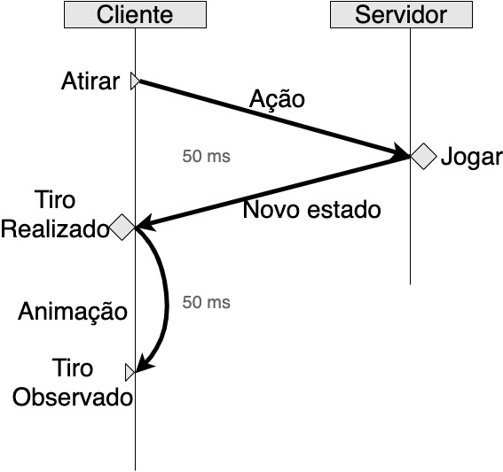
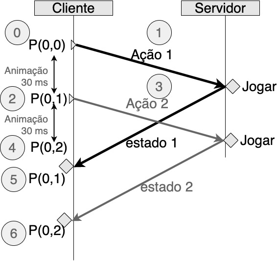

# Predição e Reconciliação

No capítulo anterior falamos sobre o lag, ou atraso entre ação no cliente e a atualização enviada pelo servidor nos baseando no modelo de cliente servidor na qual o cliente não responde seu estado, mas sim a ação desejada, para que o servidor atualize seu estado. Um jogo que pode levar algumas fraçnoes de segundo para atualizar o estado pode ser considerado de jogabilidade ruim ou injogável devido ao lag de renderização. Assim, neste capítulo vamos explorar uma solução para minimizar este problema.

## Predição pelo lado do cliente 

Como a maior parte dos jogos é deterministico, ou seja, não há aleatoriedade no resultado, podemos prever qual vai ser o próximo passo do jogo antes do servidor responder. Para maior parte das pessoas jogando esta experiência será "idêntica" ao jogo sem servidor, mas para as pessoas trapaceando a experiência não será realistica, desfavorecendo o jogo com trapaças. Assim, podemos assumir que nosso servidor recebrá ações válidas para 99% dos casos, nos permitindo prever o próximo instante.

No cenário que descrevemos anteriormente nossa ação com o servidor levava 50 ms para atualizar o estado do jogo, para só então uma animação ser ativada (digamos que ela leve mais 50 ms) como a imagem a seguir nos mostra:

Nessa imagem podemos ver que o atraso do servidor (50 ms) mais o tempo de animação (50 ms) fará com que percebemos o tiro apenas 100 ms depois dele ter sido realizado, ou seja, no terceiro frame que nosso olho detecta, certamente uma experiência desagradável. 

Como o jogo nosso jogo é deterministico, podemos presumir que a ação será executada com sucesso no servidor, aplicar nossas regras locais de validação e iniciar a animação do tiro no momento em que pressionamos o botão para realizar a ação. Para a grande maioria dos casos a atualização do servidor e o final da animação vão coincidir em estado e fizemos um predição bem sucedida, fazendo com que não exista atrasos entre a ação e a renderização. Para os casos de trapaça a animação ocorrerá, mas em nada afetará o estado geral do jogo, somente afetará negativamente a experiência do usuário trapacendo.

### Problemas de sincronização

Infelizmente essa estratégia não é perfeita e problemas de sincronização ou eventos conflitantes podem acontecer. Imagine agora o cenário na qual o personagem está se movimentando e o tempo de atraso é 75 ms em vez dos 50 ms anteriores, o tempo da animação é de 30 ms e a pessoa pressiona para se movimentar para frente 2 vezes seguidas. A imagem a seguir e os passos marcados na imagem exemplificam:

0. Personagem está o ponto `(0,0)` no instante 0 ms.
1. Neste mesmo instante a pessoa pressiona para se movimentar enviando uma ação para o servidor que durará 75 ms.
2. A ação do passo 1 ativou uma animação que moveu o personagem para a posição `(0,1)` 30 ms depois.
3. Na posição `(0,1)` uma nova açnao de movimentação acontece, enviando esta nova ação para o servidor que durará mais 75 ms.
4. A ação do passo 3 ativou uma nova animação que moveu o personagem para a posição `(0,2)` 30 ms depois. Já se passaram 60 ms.
5. 15 ms depois de terminar a ação 4, o servidor respondeu a ação 1 fazendo o personagem voltar para posição `(0,1)`. Já se passaram 75 ms.
6. 30 ms depois de terminar a ação 5, o servidor respondeu a æção 3 fazendo o personagem voltar para posição `(0,2)`. Ja se passaram 105 ms.

Com este detalhamento podemos ver que pelo ponto de vista da pessoa jogando, o personagem vai responder as duas primeiras ações se movimentando até a posição `(0,2)` para então voltar para posição `(0,1)` e depois ainda voltar para posição `(0,2)` gerando uma péssima experiência de jogo, forçando assim a adotarmos uma estratégia de reconciliação.

## Reconciliacão pelo servidor

A chave deste problema é entender a diferenca temporal dos cliente e do servidor, já que o cliente vê o jogo em tempo real (presente) e o servidor autoritário está no passado. Assim, sempre haverá uma diferença de sequência de comandos a serem processados entre o cliente e o servidor. Felizmente isso não é muito difícil de resolver.

Primeiro passo é fazer com que o cliente salve suas ações em uma sequência de comandos, assim a primeira movimentação seria a ação `#1` e a segunda movimentação seria a ação `#2`. Logo, o servidor poderá respoderá responder uma ação identificando a qual comando ela pertence. A figura a seguir exemplifica o que acontece:

1. O evento `#1` é lancado, 30 ms depois da animação a posição `#1 => (0,1)` é registrada e 38 ms depois o servidor recebe a ação `#1`. A sequência de comandos é `[#1 => (0,1)]`.
2. O evento `#2` é lancado, 30 ms depois da animação a posição `#2 => (0,2)` é registrada e 38 ms depois o servidor recebe a ação `#2`.  A sequência de comandos é `[#1 => (0,1), #2 => (0,2)]`.
3. O evento `#1` é retornado pelo servidor com o valor `#1 => (0,1)`. a função `check` para o estado da sequência de comandos atual (`[#1 => (0,1), #2 => (0,2)]`) e o evento `#1 => (0,1)` recebido é executada para reconciliar. Remove todos os comandos até `#1 => (0,1)` da sequência de comandos.
4. O evento `#2` é retornado pelo servidor com o valor `#2 => (0,2)`. a função `check` para o estado da sequência de comandos atual (`[#2 => (0,2)]`) e o evento `#2 => (0,2)` recebido é executada para reconciliar. Remove todos os comandos até `#2 => (0,2)` da sequência de comandos.
5. Sequência de comandos é `[]`.

> **Descrição da função `check`**
> 1. Argumentos são **sequência de comandos executados** e **evento #**.
> 2. Verifica se o valor de `#n` na sequência de comando é igual ao que o servidor retornou. Caso não for igual retorna erro.
> 3. Aplica o próximo evento, `#n+1`, ao resultado do evento `#n`. Caso o resultado de `#n` mais o evento `#n+1` não corresponder ao evento salvo na sequência de comandos para `#n+1` retornar erro.
> **Observação**: Se o evento que o servidor responder não for `#n` esperado, podemos concluir que o pacote se perdeu ou o servidor retornou um erro, assim existem duas alternativas **1.** descartar todos os pacotes até o evento recebido e fazer o check, ou **2.** aplciar todos os eventos anteriores até o evento recebido. Particularmente vejo a soluação **1** sendo a mais comum, pois sabemos que o estado anterior está certo.

Este é um exemplo bem simples de movimentação e bastante intuitivo de visualizar, mas as aplicações de predição e reconciliação podem ser feitas em praticamente qualquer área do jogo e qualquer tipo de jogo. Imagine um jogo de corrida multiplayer e você está na linha de chegada em velocidade máxima, com um carro logo atrás de você. No próximo segundo considerando as atuais circunstâncias, é óbvio que voê vai ganhar, pois você está na frente do outro carro e com uma velocidade maior, mas agora imagine que alguns milésimos antes do final da corrida a outra pessoa apertou o botão de nitro e te ultrapassou. A predição diria que seu carro ganharia a corrida, mas o servidor disse que não e você ficou em segundo lugar. Isso nos leva a um ponto interessante, mesmo em ambientes deterministicos, existe a chance da predição e da reconciliação não serem iguais, Para um cenário de fim de jogo como descrito aqui é bastante trivial a resposta, ignore a predição e responda com o resultado do servidor, porém se isso acontecer frequentemente no meio do jogo a experiência de jogabilidade vai ser ruim. 

No próximo capítulo vamos explorar como resolver este problema de predição e reconciliação através de interpolação de entidades.