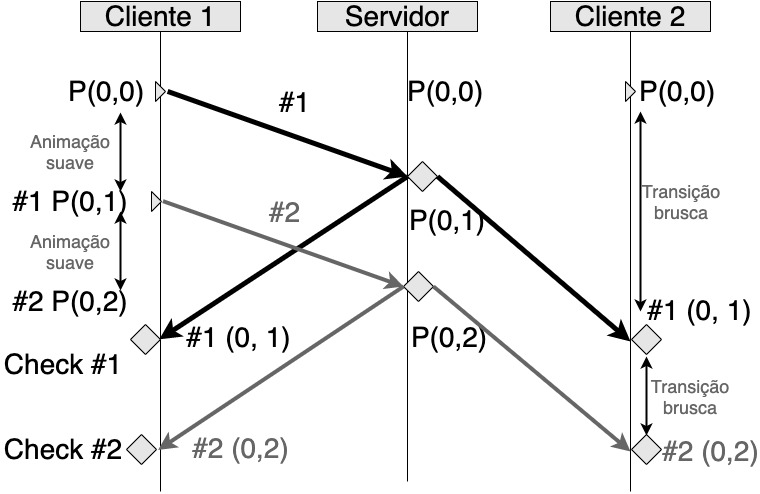
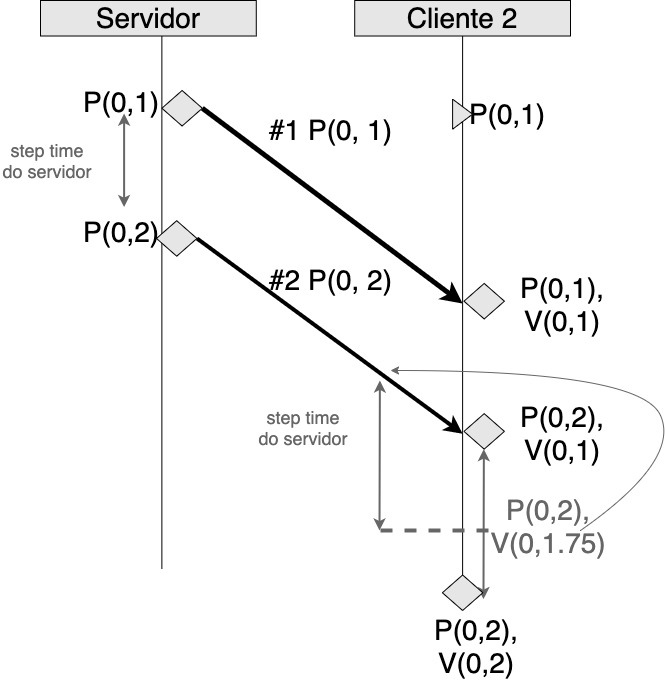

# Interpolação de Entidades

Nos capítulos anteriores lidamos com o problema de uma pessoa poder trapacear e como fazer com que o jogo se mantenha conciliado com um servidor autoritário dando a sensação de que o servidor não existe, porém não expandimos este problema para quando estamos lidando com mais de uma pessoa jogando online. Neste capítulo vamos explorar técnicas que nos permitem manter a jogabilidade quando várias pessoas estão interagindo umas com as outras em um ambiente online.

## Lidando com centenas de ações simultâneas

No capítulo anterior falamos sobre o servidor processar uma sequência de comandos e retornar como eventos autoritários para o cliente. Imagine agora que este cliente está alucinadamente mandando eventos para o servidor e que ele não está sozinho, pois existem mais uma dezena de clientes mandando eventos simultaneamente para o servidor. Sendo assim, atualizar o estado do jogo para cada comando recebido de cada cliente e depois transmitir o estado do jogo de volta para cada cliente consumiria muita CPU e muita banda.

Tendo em vista evitar o consumo desnecessário de CPU e banda outra abordagem parece fundamental. Esta nova abordagem consiste em enfileirar os comandos que os clientes enviam, sem processar eles, e em vez de atualizar o estado do jogo imediatamente para cada comando, fazemos atualizações periódicas e de baixa frequência, por exemplo 10 vezes por segundo. Este atraso entre cada update, no caso do nosso exemplo de 100 ms, é chamado de *time step*, ou passo temporal. O *time step* é definido como uma iteração de loop de update na qual todas as informações não processdas de todos clientes são aplicadas e o novo estado é transmitido para todos os clientes. Ou seja, o estado do jogo é atualizado com uma periodicidade específica de forma independente e não é afetado pela quantidade de clientes e seus comandos.

**Obs**: Muitas vezes a física do jogo é atualizada em passos de tempo menor para aumentar a previsibilidade.

## Updates de baixa frequência

Seguindo com o conceito de um update de estado a cada 100 ms um novo problema aparece, os outros clientes não tem ideia de como seus oponentes estão se atualizando, gerando eventos que parecem bastante bruscos a cada atualização. Ou seja, predição e reconciliação funcionam muito bem para o lado do cliente, mas não para o resto das pessoas jogando. A imagem a seguir detalha melhor essa situação:

Na imagem anterior podemos ver o mesmo cenário de predição e reconciliação funcionando muito bem para o `Cliente 1`, permitindo que sua jogabilidade seja coerente com a jogabilidade de um jogo single-player, porém para o `Cliente 2` podemos ver que as transições `(0,0) -> (0, 1)` e `(0, 1) -> (0, 2)` do `Cliente 1` são bruscas para o `Cliente 2`, já que estas atualizações dependem exclusivamente das atualizações do servidor.

Agora voltando ao exemplo dos carros que mencionamos no final do capítulo anterior. Estamos em uma situação na qual temos controle do nosso carro, mas o carro da outra pessoa é determinado pelo servidor. Se este carro recebe atualizações apenas a cada 100 ms, teremos uma animação péssima de seu deslocamento, nos obrigando a encontrar outra solução para melhorar a experienência. Esta outra soluação envolve fazer a predição da posição do outro carro do lado do nosso cliente, pois sabemos sua direção, sua velocidade e temos certeza que o carro não fará um movimento radical, como girar 180 graus. Sendo assim, se o outro carro está indo reto com uma velocidade de 100 km/h, podemos prever que nos próximos 100 ms o carro estará 0,2 metros a frente de onde ele está neste exato segundo. Essa predição pode parecer maravilhosa, já que ele só se deslocou 0,2 metros em linha reta, mas infelizmente 100 ms é tempo suficiente para muitas outras coisas acontecerem como uma curva aparecer, bater em um poste, desacelerar ou até mesmo frear bruscamente. Chamamos está técnica de **dead reckoning**. Portanto, o **dead reckoning** é uma técnica de predição dos movimentos de outras pessoas em jogos na qual sua posição, velocidade e direção não são afetadas de forma instantânea, permitindo uma pequena margem para prever movimentos sem grandes danos à experiência. Caso alguma ação inesperada aconteça aceitamos que vamos conviver com uma cena estranha.

> **Dead reckoning** é originalmente uma estratégia militar para prever a próxima localização de um navio, que se move lentamente e sem grandes oscilações de direção, para que se possa prever onde um torpedo precisa ser lançado para acertar o navio.

## E para cenários muito dinâmicos?

Como falamos anteriormente, *dead reckoning* é bom para jogos que não são tão dinâmicos, como jogos de corrida, porém para jogos na qual as pessoas jogando se movimentam constantemente, atiram, se abaixam, pulam, giram 180 graus é impossível prever o próximo passo da pessoa apenas com dados anteriores. Se aplicássemos dead reckoning em um jogo de tiro veríamos personagens se teletransportando pequenas distâncias, múltiplas balas saindo de diferentes lugares e personagens fazendo movimentos impossíveis. Sendo assim, outra estratégia é necessária para jogos de tiro, sendo essa a **interpolação de entidades**.

No cenário descrito do parágrafo anterior, temos certeza apenas de 1 coisa, que a cada 100 ms temos uma atualização das informações do estado do jogo e dos personagens. Tendo em vista que sabemos o passado todo, o truque é mostrar para pessoa jogando o que acontece entre esses dados que já sabemos. Ou seja, a solução é mostrar para a pessoa que está jogando o passado relativo dos outros personagens. Isso que chamamos de **interpolação de entidades**.

Explicando melhor, podemos dizer que no momento `t = n + 1`, que você acabou de receber, a posição do momento `t = n` é conhecida. Sendo assim, neste momento `t = n + 1` conhecemos as posições referentes a `t = n` e `t = n + 1`. Portanto, para o momento `t = n + 2` mostramos o passado, ou seja, o que ocorreu no momento `t = n = 1` e para o momento `t = n + 1` mostramos o que ocorreu no momento `t = n` do outro personagem. Deste modo o servidor está sempre mostrando as informações reais de movimentação dos outros personagens, porém com um "pequeno atraso" de 100 ms. A imagem a seguir exemplifica:

O diagrama de interpolação nos mostra bem como estamos prevendo os passos intermediários. Para um momento inicial estamos com a posição `P(0,1)`, depois o servidor nos atualiza com a posição `P(0,1)` novamente, neste momento exibimos a posição que conheciamos antes do *step time*, a `V(0,1)`. Quando recebemos a posição `P(0,2)`, mantemos a posição `V(0,1)`, que havia sido entregue anteriormente pelo servidor. Agora sabemos o vetor de posições `[P(0, 1), #1 P(0, 1), #2 P(0, 2)]`, e podemos interpolar que no próximo *step time* nosso personagem inimigo vai para a posição `V(0,2)` passando pela posição `V(0,1.75)`, melhorando a experiência da pessoa jogadora.

Na maior parte dos casos interpolação funciona muito bem, porém existem alguns casos que pode ser importante enviar mais informações de posições intermediárias entre `#1` e `#2`. Ou seja, se atualizações de estado a cada 100 ms não são suficientes, podemos enviar as últimas 10 atualizações que ocorreram com intervalos de 10 ms, que certamente vai fazer com que seu jogo pareça mais realista. Note que está técnica faz com que cada jogadora perceba pequenas variações do ambiente do jogo em relação às outras pessoas, que geralmente não é algo perceptível. Infelizmente, nada é perfeito e existem exceções como no caso de quando damos um tiro, pois estamos atirando na personagem da outra pessoa de 100 ms atrás. É nesse caso que precisamos explorar o último tópico desta parte, compensação de lag.
